# 黄花菜的计算机图形学代码库

## 项目架构

- BNU_Graphic 
  - img *保存了每一次实验的示例动图*
  - src *项目各个实验的源代码*
    - Work0:第一次实验之装环境与熟悉git用法
    - Work1:实验二的基础任务,学习了MVP变换的基本方法
    - Work1_xz:实验二的选做任务,构造了三维正方体的旋转与映射
    - Work1_xz_cz:实验二的选做任务,利用插值法进行旋转操作
    - Work2:实验三的基础任务,构建了Bézier曲线的渲染
    - Work2_xz_yt:实验三的选做任务,构造了贝塞尔曲线的反走样绘制
    - Work2_xz_zy:实验三的选做任务,构造了B样条曲线与贝塞尔曲线的对比与切换
    - Work3:实验四的基础任务,构造了Phong光照模型
    - Work3_xz_bp:实验四的选做任务,构造了Blinn-Phong光照模型
    - Work3_xz_hs:实验四的选做任务,构造了硬阴影模型
    - Work4:实验五的基础任务,构造了光线追踪模型
    - Work4_xz_bl:实验四的选做任务,构造了玻璃材质内部全反射模型
    - Work4_xz_jc:实验四的选做任务,构造了抗锯齿模型
    - Work5:实验六的基础任务,简单实现了光栅化和可微渲染
    - Work6:实验七的基础任务,构造了质点弹簧模型
    - Work7:实验八的基础任务,实现参数化人体模型和人体模型的蒙皮操作
# 课程实验

## 实验一:图形学开发工具
- 学习了环境搭建与git的用法
- 由于啥都不会，所以实验一的代码来自参考教程

## 实验二:旋转与变换
- 学习使用了Taichi的kernel核函数的使用方法,以及其基本语法内容
- 学习理解了MVP变换的大致内容
- 学习并构建二维和三维图形的旋转与映射
- 学习了插值法实现图形的旋转
- PS:三维图形的映射在绘制线的先后顺序还有点问题

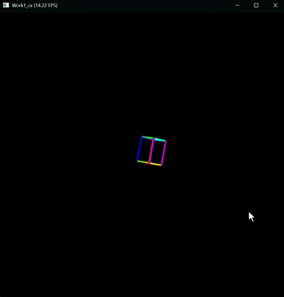

## 实验三:Bézier曲线/B样条曲线
- 理解贝塞尔曲线 (Bézier Curve) 的几何意义。
- 理解并用代码实现计算贝塞尔曲线的 De Casteljau 算法。
- 掌握“光栅化”的基础概念：如何在像素缓冲区 (Frame Buffer) 中直接操作和点亮像素。
- 掌握现代化图形界面中的鼠标点击与交互事件处理。

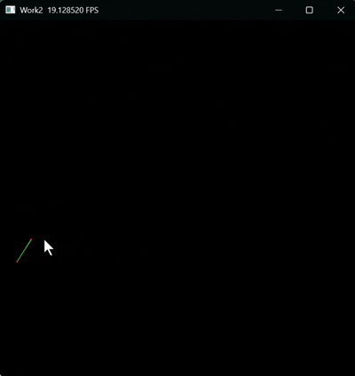
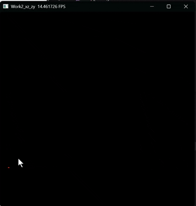
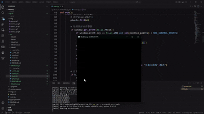

# 实验四:Phong光照模型
- 理论理解： 理解并掌握局部光照的基本原理，区分环境光（Ambient）、漫反射（Diffuse）和镜面高光（Specular）。
- 数学基础： 熟练掌握三维空间中的向量运算（法向量计算、光线方向、视线方向与反射向量）。
- 工程实践： 掌握如何利用 Taichi 实现交互式渲染，通过 UI 控件实时调节材质参数，直观感受各个参数对渲染结果的影响。

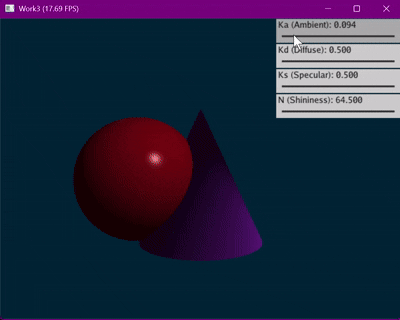
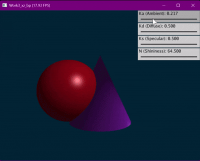
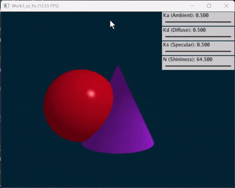

## 实验五:光线追踪
- 理论理解： 理解光线投射（Ray Casting）与光线追踪（Ray Tracing）的本质区别。
- 全局光照： 掌握如何通过发射“次级射线（Secondary Rays）”来实现硬阴影（Hard Shadows）和理想镜面反射（Perfect Reflection）。
- GPU 编程思维： 学习如何将传统的“递归”光线追踪算法改写为适合 GPU 并行计算的“迭代（循环）”模式。
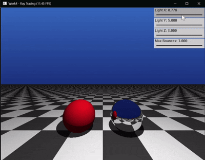
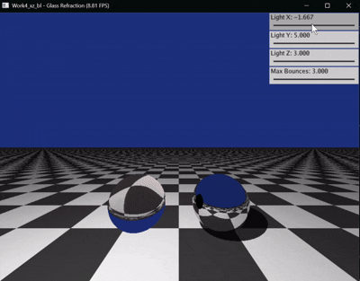
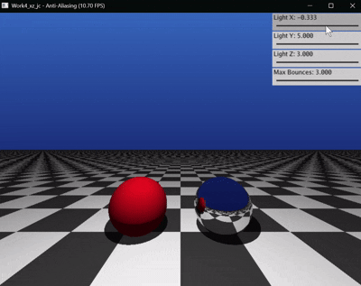

## 实验六:可微渲染
- 理解并掌握可微光栅化的原理，特别是在处理离散几何体（Mesh）边界时的数学近似方法。
- 掌握如何通过多视角的二维图像（剪影/RGB）反推并优化三维空间中的网格顶点坐标。
- 深刻理解在网格优化过程中，正则化对于防止拓扑崩坏和陷入局部最优的决定性作用。
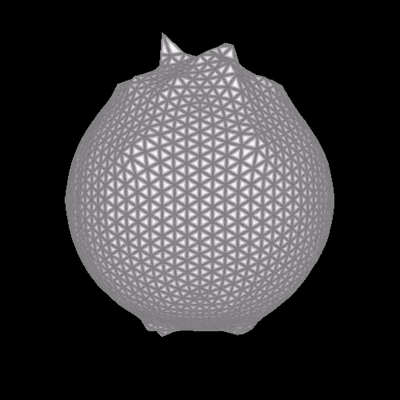

## 实验七:质点弹簧模型
- 掌握动态场景渲染：了解并使用 Taichi 框架构建 3D 场景，学习使用 Taichi GGUI 编写交互面板。
- 理解质点-弹簧模型：掌握基于物理的弹力与阻尼力计算方法，并处理数值爆炸问题（如速度钳制）。
- 对比数值积分方法：独立编写并比较三种常见的数值积分求解器（显式欧拉、半隐式欧拉、隐式欧拉），观察并理解它们在物理模拟中的稳定性差异。
- 理解 GPU 编程基础：学习 Taichi 中的 ti.kernel 与 ti.func，了解并行计算中的状态同步与 Kernel 启动开销优化。
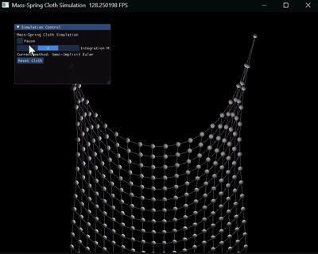

## 实验八:LBS蒙皮
- 理解参数化人体模型中模板网格、形状参数、姿态参数、关节回归器和蒙皮权重之间的关系。 
- 理解LBS四个阶段： 
  - (a) 模板网格$$ \bar{T}$$与蒙皮权重$$\mathcal{W}$$
  - (b) 形状校正后网格$$\bar{T} + B_S(\beta)$$以及关节$$J(\beta)$$
  - (c) 姿态校正后网格$$T_P(\beta,\theta)=\bar{T}+B_S(\beta)+B_P(\theta)$$
  - (d) 经过 LBS 之后的最终姿态结果 
- 学会调用 SMPL 模型，并把官方 lbs() 实现中的关键中间量单独提取出来做可视化。
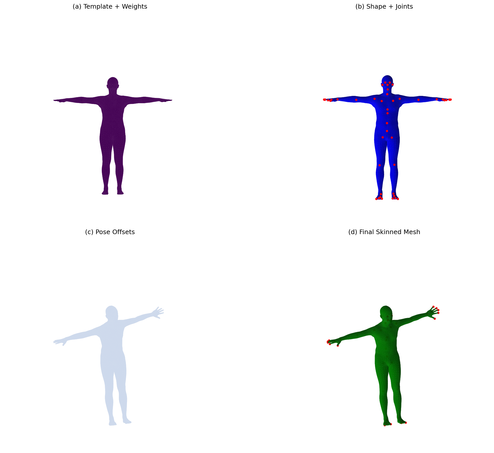
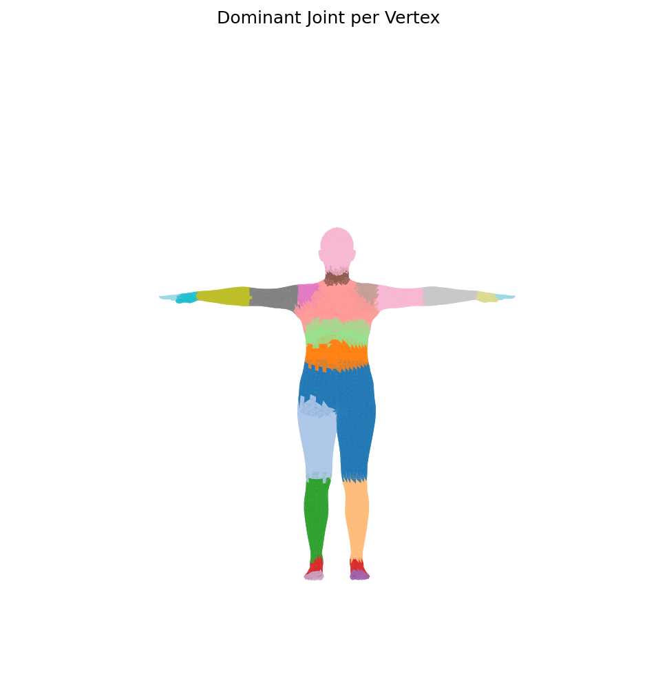
